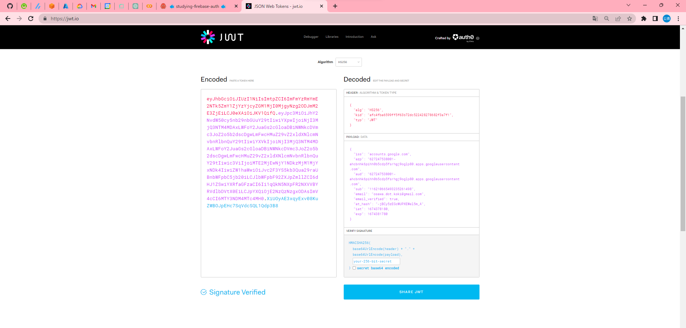

# about JWT

🔑🔑🔑 RFC7519で定義された認証トークンであるJSON Web Token(JWT)についての概要・実装方法と、その他の関連技術についてまとめたドキュメントです。  

## 目次

- [about JWT](#about-jwt)
  - [目次](#目次)
  - [JWTとは](#jwtとは)
  - [JWTの仕組み](#jwtの仕組み)
  - [ユースケース](#ユースケース)
  - [JWTの使い方](#jwtの使い方)
  - [JWTのセキュリティ](#jwtのセキュリティ)
  - [リクエスト](#リクエスト)
  - [参考文献](#参考文献)
  
## JWTとは

JWTはRFC7519で定義された認証トークンであるJSON Web Tokenの略です。  
JWTは、認証情報をJSON形式で記述したトークンを発行し、そのトークンを利用して認証を行う仕組みです。  

特徴としては、以下のようなものが挙げられます。

- 認証情報をJSON形式で記述するため、認証情報の構造を明確にすることができる。
- 自分自身で認証情報を作成し、認証情報を検証することができる。

JWTの仕組みについては、[JWTの仕組み](#jwtの仕組み)を参照してください。  

JWTはディジタル署名を用いて認証情報の検証を行います。  
ディジタル署名として、以下のようなものが挙げられます。  

- ハッシュ認証(HMAC)
- 公開鍵認証(RSA・ECDSA)
  
署名されることによって、認証情報が改竄されていないことを検証することができます。  
これによって認証情報の完全性を保証することができます。  

また、公開鍵認証を用いることで、認証情報の検証者を特定することができます。  
これによって認証情報の真正性を保証することができます。  

## JWTの仕組み

JWTは、以下のような構造を持ちます。  

- ヘッダー
- 認証情報
- 署名

ヘッダーは、JWTの署名に用いるアルゴリズムを記述したJSON形式のデータです。  

認証情報は、JWTの認証情報に用いるJSON形式のデータです。  

署名は、JWTの認証情報に用いるアルゴリズムを用いて署名したデータです。  

---

JWTは、ヘッダーと認証情報を`.`で連結した文字列をBase64エンコードしたものを、署名としています。  
これによって、JWTの構造を明確にすることができます。  

JWTの中身は、以下のサイトで確認することができます。  

<https://jwt.io/introduction>  

  

## ユースケース

JWTは以下のようなユースケースに用いられます。  

- 認証情報の交換
- 認証情報の検証

一般的にはCookieに代わる認証情報として使用されることが多いです。  

Cookieではそれそのものには認証情報を持たないため、認証情報をCookieに保存することができません。  
これに対して、JWTは認証情報を持つため、Cookieに代わる認証情報として使用することができます。  

当然、改竄に対してもディジタル署名を用いて検知することができるため、Cookieと同程度、もしくはそれ以上の安全性を持つことができます。  

また、Cookieがデータベースを用いて認証情報を管理するのに対して、JWTはデータベースを用いないため、データベースの負荷を軽減することができます。  
これによって、サーバーの負荷を軽減することができ、パフォーマンスの向上につながります。  

## JWTの使い方

専用のライブラリを用いることで、簡単にJWTを作成することができます。  
言語とバージョンによって異なるため、ここでは、ライブラリの具体的な使い方についての説明は省略します。  

## JWTのセキュリティ

JETは認証情報を含むため、セキュリティについては非常に重要な要素となります。  
したがって、データの保存には十分な注意を払う必要があります。  

具体的には保存場所として、ローカルストレージを用いることは避けるべきです。  
代わりにセッションストレージを用いることを推奨します。  

また、Cookieに保存することも可能です。  

## リクエスト

JWTは、リクエストヘッダーに`Authorization`というキーで送信されます。  
認証のスキームは`Bearer`を用います。  

```header
Authorization: Bearer <token>
```

## 参考文献

- [RFC7519](https://tools.ietf.org/html/rfc7519)
- [JWT](https://jwt.io/introduction)
